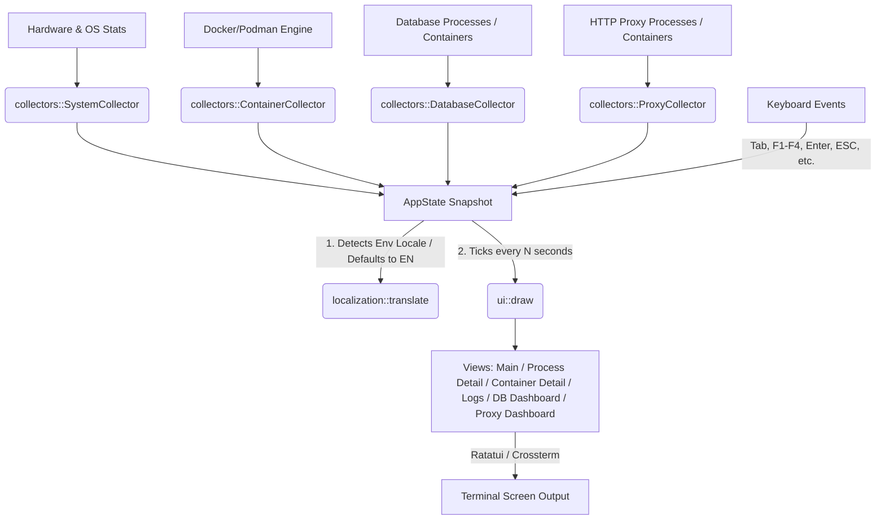

# rtop 🚀

[](https://github.com/rebienkrdns/rtop/actions/workflows/ci.yml)
[](#license)

`rtop` is a modern, fast, and lightweight terminal-based system resource monitor (TUI) written in Rust. It runs on **macOS and Linux** and provides real-time CPU, memory, disk, and network metrics alongside native Docker/Podman container monitoring, application-aware database and HTTP proxy dashboards, historical metric charts, and multiple premium themes — all in a beautifully crafted terminal interface.

---

## 📸 Screenshots

<details>
<summary>🖼️ Explore the interface</summary>


</details>

---

## ✨ Features

- **Real-time system monitoring** — CPU, RAM, Swap, Disk I/O, and Network throughput in a clean 2-column layout
- **Process monitoring** — sortable table with per-process CPU, memory, and disk read/write speeds; full process detail view
- **Docker/Podman integration** — native container monitoring with stats, logs, restart/stop controls
- **Application-aware database dashboards** — auto-detects PostgreSQL, MySQL, and MariaDB processes (local or in containers) and renders live metrics with historical Braille charts
- **HTTP proxy monitoring** — auto-detects Traefik, Nginx, and Apache2 with SRE-grade metrics: RPS, error rate, latency percentiles (p50/p95/p99), and per-status-class counters
- **Historical metrics charts** — Braille-rendered canvas charts for CPU, memory, disk, and network history; configurable time ranges (1 min → 5 min → 15 min → 1 hour)
- **Premium themes** — Default, Dracula, Gruvbox, and Tokyo Night; cycle with `F4` or the on-screen button
- **Dynamic localization** — automatic English/Spanish UI based on your system locale (`LANG`, `LC_ALL`, `LC_MESSAGES`)
- **Minimal footprint** — under 15 MB RAM at runtime

---

## 🏗️ Architecture



---

## ⚡ Installation

### 1. Quick Installation Script (Linux & macOS)
Automatically detects your OS and architecture, downloads the latest pre-compiled binary, and installs it to `/usr/local/bin/`:

```bash
curl -fsSL https://github.com/rebienkrdns/rtop/raw/master/install.sh | sh
```

### 2. From Crates.io
If you have Cargo installed:

```bash
cargo install rtop
```

### 3. Packages for Linux Distributions
Download the packages directly from the [GitHub Releases](https://github.com/rebienkrdns/rtop/releases):
*   **Debian/Ubuntu (`.deb`):** `sudo dpkg -i rtop_*.deb`
*   **RHEL/CentOS/Fedora (`.rpm`):** `sudo rpm -i rtop_*.rpm`

### 4. Compiling from Source
```bash
git clone https://github.com/rebienkrdns/rtop.git
cd rtop
cargo build --release
```
The optimized binary will be located in `target/release/rtop`.

---

## ⚙️ Configuration

`rtop` stores its configuration file at `~/.config/rtop/config.toml` (or the path specified by the `RTOP_CONFIG_PATH` environment variable). The file is generated automatically with default values on first launch.

### `config.toml` Example

```toml
# Refresh interval in seconds (supported values: 0.5, 1.0, 2.0, 5.0, 10.0, 30.0, 60.0)
refresh_interval_secs = 2.0

# Default disk device to monitor for I/O (e.g., "nvme0n1", "sda")
# If set to None, rtop tries to autodetect the primary disk
selected_disk = "nvme0n1"

# Default network interface to monitor (e.g., "eth0", "wlan0")
# If set to None, it aggregates traffic of all active interfaces
selected_nic = "eth0"

# Active tab at startup ("processes" or "containers")
default_tab = "processes"

# Column to sort processes by ("cpu", "memory", "pid", "name")
process_sort_column = "cpu"

# Show or hide Swap memory section
show_swap = true

# Active theme ("default", "dracula", "gruvbox", "tokyo_night")
theme = "default"

# Custom path to the Docker socket (e.g., "/var/run/docker.sock")
# docker_socket_path = "/var/run/docker.sock"
```

---

## ⌨️ Keyboard Shortcuts

| Key | Action |
| :---: | :--- |
| `q` / `Ctrl+C` | Quit the application |
| `Tab` | Toggle between tabs (Processes ↔ Containers) |
| `↑` / `↓` | Navigate lists |
| `Enter` | View details of the selected process or container |
| `ESC` | Back to previous screen / Close modal |
| `F1` | Show help modal |
| `F2` | Open disk device selector |
| `F3` | Open network interface selector |
| `F4` | Cycle through themes (Default → Dracula → Gruvbox → Tokyo Night) |
| `[` | Decrease refresh interval (faster updates) |
| `]` | Increase refresh interval (slower updates) |
| `c` | Sort processes by CPU usage |
| `m` | Sort processes by Memory usage |
| `r` | Sort processes by Disk Read speed |
| `w` | Sort processes by Disk Write speed |
| `/` | Filter processes/containers by name |
| `h` | Toggle between historical charts and real-time view |
| `t` | Cycle history time ranges (1 min → 5 min → 15 min → 1 hour) |
| `L` | *(Containers)* View logs in detail view |
| `R` | *(Containers)* Restart container (requests confirmation) |
| `S` | *(Containers)* Stop container (requests confirmation) |

---

## 🔄 HTTP Proxy Monitoring

`rtop` auto-detects running **Traefik**, **Nginx**, and **Apache2** instances — both as local processes and inside Docker/Podman containers. When you open the detail view of a detected proxy process or container, `rtop` renders a dedicated SRE-grade dashboard.

### Metrics collected for all proxies

| Metric | Description |
| :--- | :--- |
| **RPS** | Requests per second (derived from request counter delta between ticks) |
| **Error Rate %** | Percentage of 4xx + 5xx responses over total requests |
| **Active Connections** | Current open connections to the proxy |
| **Status 1xx** | Informational responses counter |
| **Status 2xx** | Successful responses counter |
| **Status 3xx** | Redirect responses counter |
| **Status 4xx** | Client error responses counter |
| **Status 5xx** | Server error responses counter (always shown in red) |
| **p50 latency** | Median request duration in milliseconds |
| **p95 latency** | 95th-percentile request duration in milliseconds |
| **p99 latency** | 99th-percentile request duration in milliseconds |
| **Workers (Busy / Idle)** | Active and idle worker threads (Apache2 and Nginx) |

### Dashboard views

- **Real-time view** (default `h` off): color-coded gauge bars for each HTTP status class (1xx → 5xx), plus a text summary with Error Rate %, Total Requests, Active Connections, and Worker counts.
- **Historical view** (`h` key): nine Braille canvas charts over the last 60 polling samples — **RPS**, **1xx**, **2xx**, **3xx**, **4xx**, **5xx**, **p50**, **p95**, **p99** — plus the same numeric summary panel below.

---

### 🔷 Traefik

`rtop` connects to Traefik's Prometheus metrics endpoint (`GET /metrics`) to collect data. This is the most feature-rich integration: all metrics including latency percentiles are available.

#### Requirements

1. **Enable Prometheus metrics** in your Traefik static configuration.

   **Option A — `traefik.yml`** (recommended for file-based config):
   ```yaml
   entryPoints:
     web:
       address: ":80"
     metrics:
       address: ":9090"        # dedicated port for rtop

   metrics:
     prometheus:
       addEntryPointsLabels: true
       addRoutersLabels: true
       addServicesLabels: true
       entryPoint: metrics     # serve /metrics on the dedicated port
       buckets:
         - 0.005
         - 0.01
         - 0.025
         - 0.05
         - 0.1
         - 0.25
         - 0.5
         - 1.0
         - 2.5
         - 5.0
   ```

   **Option B — Docker `command:` flags** (for Docker-based deployments):
   ```yaml
   command:
     - "--entrypoints.web.address=:80"
     - "--entrypoints.metrics.address=:9090"
     - "--metrics.prometheus=true"
     - "--metrics.prometheus.addentrypointslabels=true"
     - "--metrics.prometheus.addrouterslabels=true"
     - "--metrics.prometheus.addserviceslabels=true"
     - "--metrics.prometheus.entrypoint=metrics"
     - "--metrics.prometheus.buckets=0.005,0.01,0.025,0.05,0.1,0.25,0.5,1.0,2.5,5.0"
   ```

   > **Important:** The flags must be in the `command:` section of `docker-compose.yml`, **not** in `labels:`. Labels are Docker metadata and are not passed to the Traefik process.

2. **Expose port 9090** in your `docker-compose.yml`:
   ```yaml
   ports:
     - "80:80"
     - "443:443"
     - "9090:9090"   # Prometheus metrics endpoint — required for rtop
   ```

3. **Verify** the endpoint is reachable before starting `rtop`:
   ```bash
   curl http://localhost:9090/metrics | head -20
   # Should output lines like:
   # traefik_entrypoint_requests_total{...} 123
   ```

#### Prometheus metrics parsed by rtop

| Prometheus metric | rtop usage |
| :--- | :--- |
| `traefik_entrypoint_requests_total{code="1xx"}` | Status 1xx counter |
| `traefik_entrypoint_requests_total{code="2xx"}` | Status 2xx counter |
| `traefik_entrypoint_requests_total{code="3xx"}` | Status 3xx counter |
| `traefik_entrypoint_requests_total{code="4xx"}` | Status 4xx counter |
| `traefik_entrypoint_requests_total{code="5xx"}` | Status 5xx counter |
| `traefik_entrypoint_request_duration_seconds_bucket` | p50 / p95 / p99 via histogram interpolation |
| `traefik_entrypoint_open_connections` | Active connections |

> The fine-grained histogram buckets (`0.005` → `5.0`) are required for accurate percentile resolution. With Traefik's default coarser buckets the p50/p95/p99 values will be approximations.

---

### 🟩 Nginx

`rtop` connects to Nginx's built-in `ngx_http_stub_status_module` endpoint (`GET /nginx_status`).

#### Requirements

1. **Compile Nginx with `ngx_http_stub_status_module`** (included by default in most distributions) and add a `location` block:
   ```nginx
   server {
       listen 80;

       location /nginx_status {
           stub_status on;
           allow 127.0.0.1;
           allow ::1;
           deny all;
       }
   }
   ```

2. **Reload Nginx** after the configuration change:
   ```bash
   nginx -t && nginx -s reload
   # or with systemd:
   sudo systemctl reload nginx
   ```

3. **Verify** the endpoint is reachable:
   ```bash
   curl http://localhost/nginx_status
   ```
   Expected output:
   ```
   Active connections: 5
   server accepts handled requests
    1234 1234 5678
   Reading: 0 Writing: 1 Waiting: 4
   ```

#### Metrics source

| `stub_status` field | rtop usage |
| :--- | :--- |
| `Active connections` | Active connections counter |
| `requests` (cumulative) | RPS (delta between ticks), Total Requests |
| `Reading` | Connections in header-read phase |
| `Writing` | Connections sending a response |
| `Waiting` | Keep-alive idle connections |

> **Note:** Nginx `stub_status` does not expose per-status-class counters (1xx–5xx) or latency percentiles natively — those metrics show as `0`. For full SRE metrics, add the [nginx-prometheus-exporter](https://github.com/nginxinc/nginx-prometheus-exporter) sidecar and point it at `/nginx_status`.

---

### 🔴 Apache2 / Apache HTTP Server

`rtop` connects to Apache's `mod_status` endpoint with the machine-readable format (`GET /server-status?auto`).

#### Requirements

1. **Enable `mod_status`** and set `ExtendedStatus On`:

   **Debian/Ubuntu** (`/etc/apache2/mods-enabled/status.conf`):
   ```bash
   sudo a2enmod status
   ```

   Then add or edit the configuration:
   ```apache
   # /etc/apache2/conf-available/status.conf  (Debian/Ubuntu)
   # /etc/httpd/conf.d/status.conf             (RHEL/CentOS/Fedora)

   ExtendedStatus On

   <Location "/server-status">
       SetHandler server-status
       Require local
       # To allow a specific network range:
       # Require ip 192.168.1.0/24
   </Location>
   ```

2. **Reload Apache** after configuration changes:
   ```bash
   apachectl configtest && apachectl graceful
   # or with systemd:
   sudo systemctl reload apache2   # Debian/Ubuntu
   sudo systemctl reload httpd     # RHEL/CentOS/Fedora
   ```

3. **Verify** the endpoint is reachable:
   ```bash
   curl http://localhost/server-status?auto
   ```
   Expected output (truncated):
   ```
   Total Accesses: 1234
   Total kBytes: 5678
   Uptime: 3600
   ReqPerSec: 0.34
   BytesPerSec: 1600
   BytesPerReq: 4700
   BusyWorkers: 3
   IdleWorkers: 47
   Scoreboard: _WKKG___...
   ```

#### Metrics source

| `mod_status` field | rtop usage |
| :--- | :--- |
| `Total Accesses` | RPS (delta between ticks), Total Requests |
| `BusyWorkers` | Busy worker threads |
| `IdleWorkers` | Idle worker threads |
| `Scoreboard` | Reading / Writing / Waiting connection state breakdown |

> **Note:** Apache `mod_status` does not expose per-status-class counters or latency percentiles — those metrics show as `0`. Use `mod_logio` + a Prometheus exporter for full SRE metrics.

---

## 🗄️ Database Monitoring

`rtop` automatically detects running **PostgreSQL**, **MySQL**, and **MariaDB** instances — whether running as local processes or inside Docker/Podman containers. When you enter the detail view of a detected database process or container, `rtop` renders an application-specific dashboard with live metrics and historical Braille charts.

No manual configuration is needed for local instances using default socket/port settings.

---

### 🐘 PostgreSQL

`rtop` connects to PostgreSQL on port **5432** (default) and queries the `pg_stat_*` system views.

#### Metrics collected

| Metric | Source | Description |
| :--- | :--- | :--- |
| **Active connections** | `pg_stat_activity` | Current client connections |
| **Max connections** | `pg_settings` | Server `max_connections` setting |
| **Connections %** | Derived | Active / Max ratio |
| **TPS** | `pg_stat_database` delta | Transactions per second (commits + rollbacks) |
| **Cache hit rate %** | `pg_stat_bgwriter` | Buffer pool hit ratio — high values (>99%) mean low disk I/O |
| **Commits** | `pg_stat_database` | Cumulative committed transactions |
| **Rollbacks** | `pg_stat_database` | Cumulative rolled-back transactions |
| **Seq scans** | `pg_stat_user_tables` | Sequential table scans — high values signal missing indexes |
| **Index scans** | `pg_stat_user_tables` | Index scans |
| **Rows inserted** | `pg_stat_user_tables` | Cumulative rows inserted |
| **Rows updated** | `pg_stat_user_tables` | Cumulative rows updated |
| **Rows deleted** | `pg_stat_user_tables` | Cumulative rows deleted |
| **Temp files** | `pg_stat_database` | Temp files written to disk — signals memory pressure |
| **Deadlocks** | `pg_stat_database` | Deadlock count |
| **Replication lag** | `pg_stat_replication` | Bytes behind primary (replica nodes only) |

#### Setup

For local instances with the default `postgres` superuser no setup is needed. For restricted users:

```sql
CREATE USER rtop_monitor WITH PASSWORD 'secret';
GRANT pg_monitor TO rtop_monitor;   -- PostgreSQL 10+
```

For Docker containers, add credential overrides to `config.toml`:

```toml
[databases.postgresql]
user     = "rtop_monitor"
password = "secret"
port     = 5432
```

---

### 🐬 MySQL

`rtop` connects to MySQL on port **3306** (default) and reads `SHOW GLOBAL STATUS` and `SHOW GLOBAL VARIABLES`.

#### Metrics collected

| Metric | Source | Description |
| :--- | :--- | :--- |
| **Active connections** | `Threads_connected` | Current client connections |
| **Max connections** | `max_connections` | Server connection limit |
| **Connections %** | Derived | Active / Max ratio |
| **QPS** | `Questions` delta | Queries per second |
| **Slow queries** | `Slow_queries` | Queries exceeding `long_query_time` |
| **InnoDB cache hit %** | Buffer pool reads vs requests | InnoDB buffer pool efficiency |
| **InnoDB buffer pool** | `Innodb_buffer_pool_pages_*` | Used / Total buffer pool pages |
| **Rows read** | `Innodb_rows_read` | Cumulative rows read by InnoDB |
| **Rows inserted** | `Innodb_rows_inserted` | Cumulative rows inserted |
| **Rows updated** | `Innodb_rows_updated` | Cumulative rows updated |
| **Rows deleted** | `Innodb_rows_deleted` | Cumulative rows deleted |
| **Commits** | `Handler_commit` | Committed transactions |
| **Rollbacks** | `Handler_rollback` | Rolled-back transactions |
| **Table lock waits** | `Table_locks_waited` | Waits on table-level locks |
| **Aborted connections** | `Aborted_connects` + `Aborted_clients` | Failed or dropped connections |

#### Setup

```sql
CREATE USER 'rtop_monitor'@'%' IDENTIFIED BY 'secret';
GRANT PROCESS, REPLICATION CLIENT ON *.* TO 'rtop_monitor'@'%';
GRANT SELECT ON performance_schema.* TO 'rtop_monitor'@'%';
FLUSH PRIVILEGES;
```

For Docker containers, add credential overrides to `config.toml`:

```toml
[databases.mysql]
user     = "rtop_monitor"
password = "secret"
port     = 3306
```

---

### 🦭 MariaDB

MariaDB is monitored identically to MySQL — it exposes the same `SHOW GLOBAL STATUS` / `SHOW GLOBAL VARIABLES` interface and the same metrics are collected. `rtop` auto-detects MariaDB by process name (`mariadbd`, `mysqld`) and container image name.

Use the same `[databases.mysql]` section in `config.toml` for credential overrides.

---

## 🌐 Dynamic Localization

`rtop` defaults to **English**. On startup, it checks standard environment variables (`LANG`, `LC_ALL`, `LC_MESSAGES`) to determine the system locale. If your system is set to **Spanish** (e.g. starting with `es`), the interface and command-line help options will automatically switch to Spanish.

---

## 🛠️ Troubleshooting

### 1. Docker Socket Permission Error
If you get a connection error when switching to the `Containers` tab:
*   Ensure your user is added to the `docker` group:
    ```bash
    sudo usermod -aG docker $USER
    ```
    *(Log out and back in to apply group changes).*
*   If you are running Podman or a non-standard socket, specify the route using `docker_socket_path` in `config.toml`.

### 2. File System `/proc` Permissions
In highly restricted containerized environments, `rtop` might fail to read `/proc`.
*   Ensure your container is run with proper host access:
    ```bash
    docker run --privileged -v /proc:/host/proc:ro rtop
    ```

### 3. Proxy panel shows "Disconnected"
*   **Traefik**: verify port 9090 is exposed and `curl http://localhost:9090/metrics` returns Prometheus text format output.
*   **Nginx**: verify `curl http://localhost/nginx_status` returns the stub_status page. Check that `stub_status on` is inside the correct `location` block and Nginx was reloaded.
*   **Apache2**: verify `curl http://localhost/server-status?auto` is reachable, `ExtendedStatus On` is set, and `mod_status` is loaded (`apachectl -M | grep status`).
*   Check that no firewall or Docker network policy is blocking `rtop` from reaching the endpoint on the host.

### 4. Database dashboard shows all zeros
*   Confirm the monitoring user has the required grants (see the setup sections above for each engine).
*   For containers, ensure the database port is mapped to the host (`ports: - "5432:5432"`) or that `rtop` runs inside the same Docker network.
*   Check that the database service is actually running: `docker ps` or `systemctl status postgresql`.

---

## 📄 License

This project is licensed under the **MIT** License. See the [LICENSE](LICENSE) file for more information.
