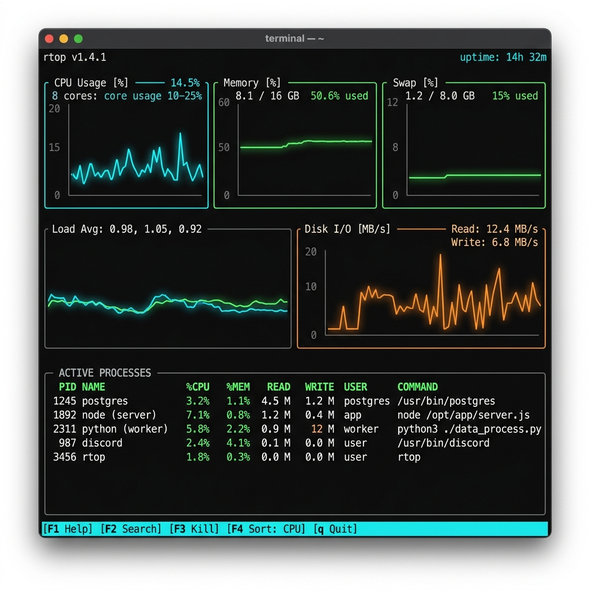
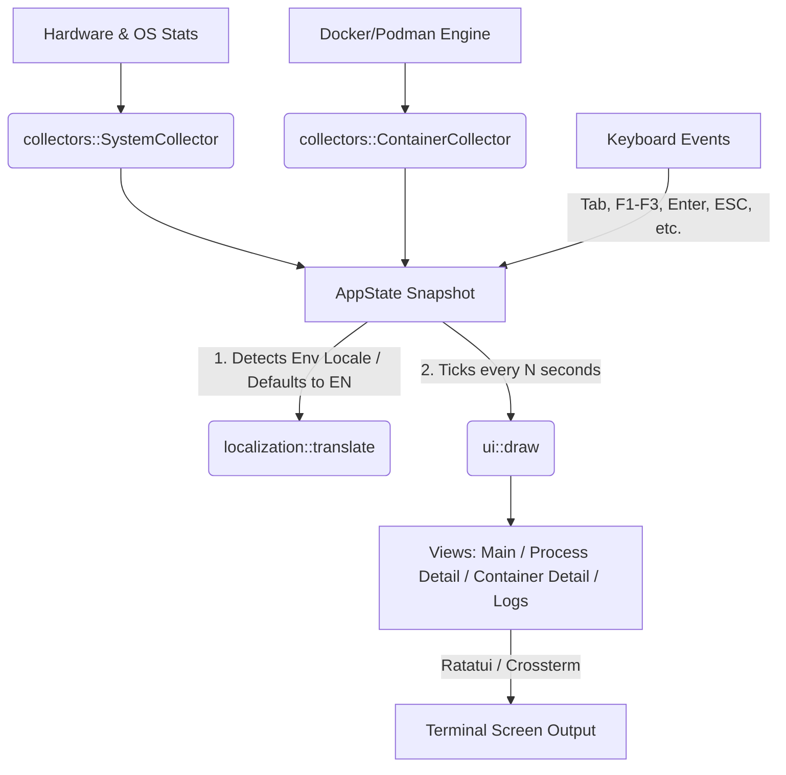

# rtop 🚀

[](https://github.com/rebienkrdns/rtop/actions/workflows/ci.yml)
[](#license)

`rtop` is a modern, fast, and lightweight terminal-based system resource monitor (TUI) written in Rust. Beyond classic monitoring metrics, `rtop` offers native Docker/Podman integration and detailed system/process-level disk I/O tracking (read/write speeds) on Linux and macOS.

---

## 📸 Demonstration

Here is a preview of the main interface running in dark mode:



---

## 🏗️ Architecture

The following diagram illustrates how `rtop` collects metrics and handles the rendering/event loop:



---

## ⚡ Installation

### 1. Quick Installation Script (Linux & macOS)
Automatically detects your OS and architecture, downloads the latest pre-compiled binary, and installs it to `/usr/local/bin/`:

```bash
curl -fsSL https://github.com/rebienkrdns/rtop/raw/master/install.sh | sh
```

### 2. From Crates.io
If you have Cargo installed:

```bash
cargo install rtop
```

### 3. macOS (Homebrew)
Install `rtop` via our custom Homebrew formula tap:

```bash
brew tap rebienkrdns/rtop
brew install rtop
```

### 4. Packages for Linux Distributions
Download the packages directly from the [GitHub Releases](https://github.com/rebienkrdns/rtop/releases):
*   **Debian/Ubuntu (`.deb`):** `sudo dpkg -i rtop_*.deb`
*   **RHEL/CentOS/Fedora (`.rpm`):** `sudo rpm -i rtop_*.rpm`

### 5. Compiling from Source
```bash
git clone https://github.com/rebienkrdns/rtop.git
cd rtop
cargo build --release
```
The optimized binary will be located in `target/release/rtop`.

---

## 📊 Comparison with Alternatives

| Feature | `rtop` 🚀 | `btop` | `ctop` | `htop` |
| :--- | :---: | :---: | :---: | :---: |
| **Written in** | **Rust** | C++ | Go | C |
| **Memory Usage** | **Minimal (< 15MB)** | Low | Medium | Minimal |
| **Docker/Podman Monitoring** | **Yes (Native)** | No | Yes (Only containers) | No |
| **Disk Read/Write per Process** | **Yes (Direct read)** | No | No | No |
| **Easy Packaging** | **Yes (`cargo`)** | Yes | Yes | Yes |

---

## ⚙️ Configuration

`rtop` stores its configuration file at `~/.config/rtop/config.toml` (or using the path specified by the `RTOP_CONFIG_PATH` environment variable). The file is generated automatically with default values the first time the program is launched.

### `config.toml` Example

```toml
# Refresh interval in seconds (supported values: 0.5, 1.0, 2.0, 5.0, 10.0, 30.0, 60.0)
refresh_interval_secs = 2.0

# Default disk device to monitor for I/O (e.g., "nvme0n1", "sda")
# If set to None, rtop tries to autodetect the primary disk
selected_disk = "nvme0n1"

# Default network interface to monitor (e.g., "eth0", "wlan0")
# If set to None, it aggregates traffic of all active interfaces
selected_nic = "eth0"

# Active tab at startup ("processes" or "containers")
default_tab = "processes"

# Column to sort processes by ("cpu", "memory", "pid", "name")
process_sort_column = "cpu"

# Show or hide Swap memory section
show_swap = true

# Custom path to the Docker socket (e.g., "/var/run/docker.sock")
# docker_socket_path = "/var/run/docker.sock"
```

---

## ⌨️ Keyboard Shortcuts

| Key | Action |
| :---: | :--- |
| `q` / `Ctrl+C` | Quit the application |
| `Tab` | Toggle between tabs (Processes ↔ Containers) |
| `↑` / `↓` | Navigate lists |
| `Enter` | View details of the selected process or container |
| `ESC` | Back to previous screen / Close help or selector modal |
| `F1` | Show help modal |
| `F2` | Open disk device selector |
| `F3` | Open network interface selector |
| `[` | Decrease refresh interval (faster updates) |
| `]` | Increase refresh interval (slower updates) |
| `c` | Sort processes by CPU usage |
| `m` | Sort processes by Memory usage |
| `r` | Sort processes by Disk Read speed |
| `w` | Sort processes by Disk Write speed |
| `/` | Filter processes/containers by name |
| `L` | *(Containers)* View logs in detail view |
| `R` | *(Containers)* Restart container (requests confirmation) |
| `S` | *(Containers)* Stop container (requests confirmation) |
| `h` | Toggle between metric history charts (Sparklines) and bar gauges |
| `t` | Cycle history time ranges (1 min → 5 mins → 15 mins → 1 hour) |

---

## 🌐 Dynamic Localization

`rtop` defaults to **English**. On startup, it checks standard environment variables (`LANG`, `LC_ALL`, `LC_MESSAGES`) to determine the system locale. If your system is set to **Spanish** (e.g. starting with `es`), the interface and command-line help options will automatically adjust to Spanish.

---

## 🛠️ Troubleshooting

### 1. Docker Socket Permission Error
If you get a connection error when switching to the `Containers` tab:
*   Ensure your user is added to the `docker` group:
    ```bash
    sudo usermod -aG docker $USER
    ```
    *(Log out and back in to apply group changes).*
*   If you are running Podman or a non-standard socket, specify the route using `docker_socket_path` in `config.toml`.

### 2. File System `/proc` Permissions
In highly restricted containerized environments, `rtop` might fail to read `/proc`.
*   Ensure your container is run with proper host access:
    ```bash
    docker run --privileged -v /proc:/host/proc:ro rtop
    ```

---

## 📄 License

This project is licensed under the **MIT** License. See the [LICENSE](LICENSE) file for more information.
