# rtop 🚀

[](https://github.com/rebienkrdns/rtop/actions/workflows/ci.yml)
[](#license)

`rtop` is a modern, fast, and lightweight terminal-based system resource monitor (TUI) written in Rust. It runs on **macOS and Linux** and provides real-time CPU, memory, disk, and network metrics alongside native Docker/Podman container monitoring, application-aware database dashboards, historical metric charts, and multiple premium themes — all in a beautifully crafted terminal interface.

---

## 📸 Screenshots

<details>
<summary>🖼️ Explore the interface</summary>

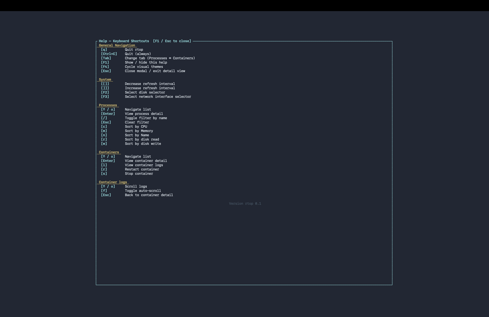

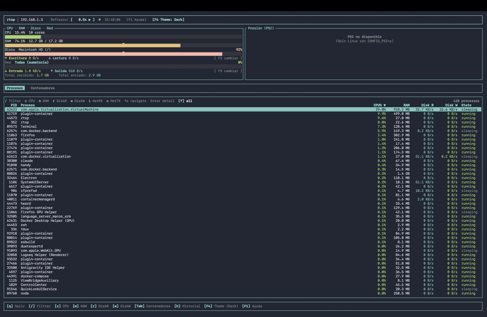

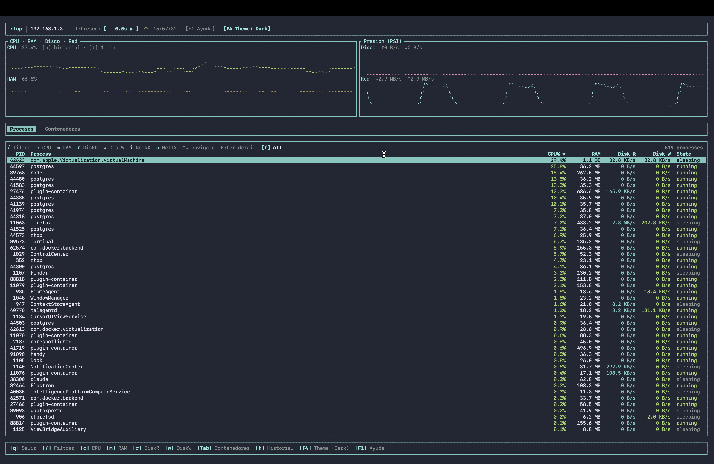

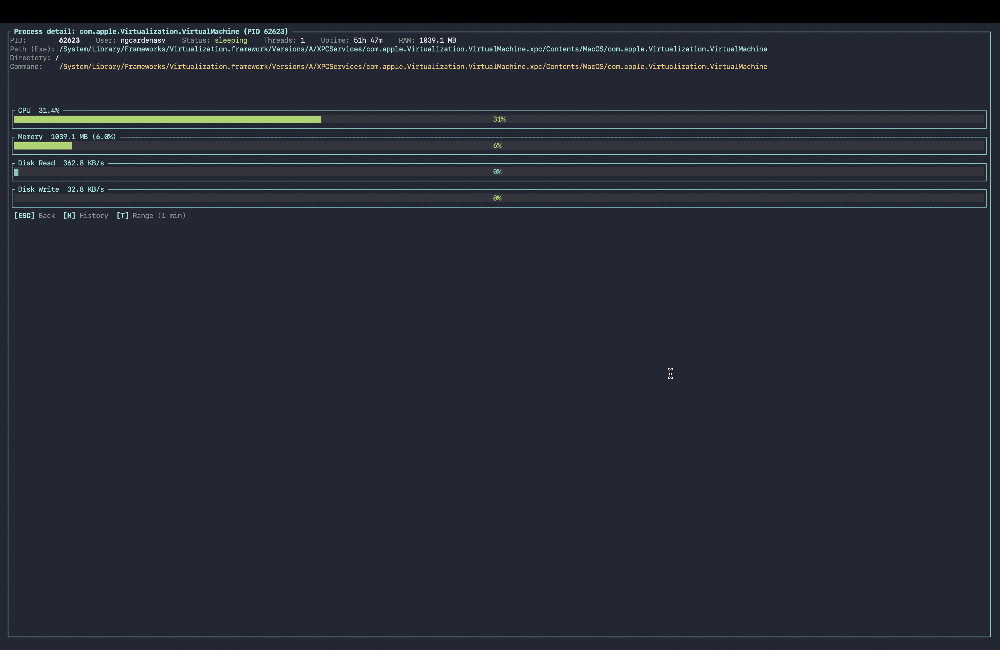

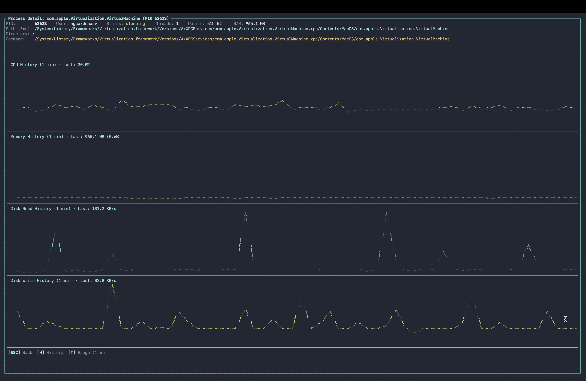

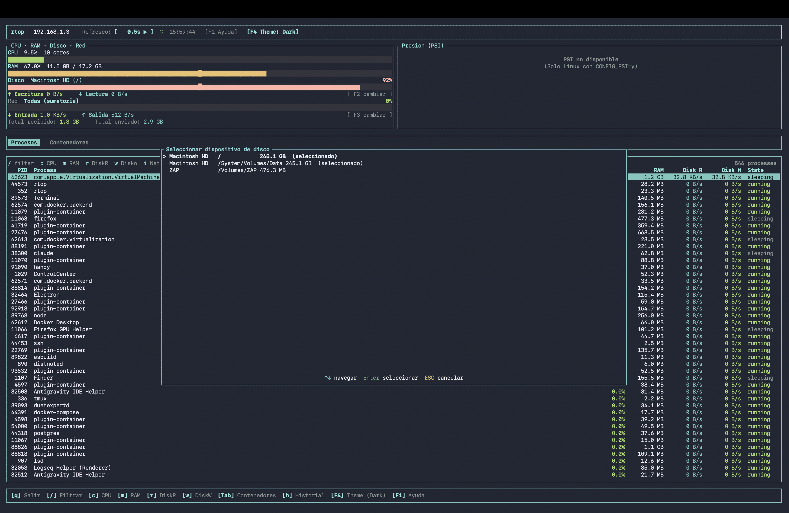

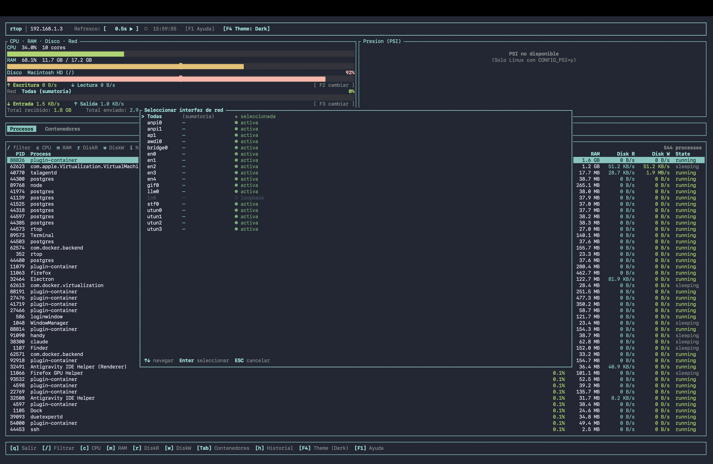

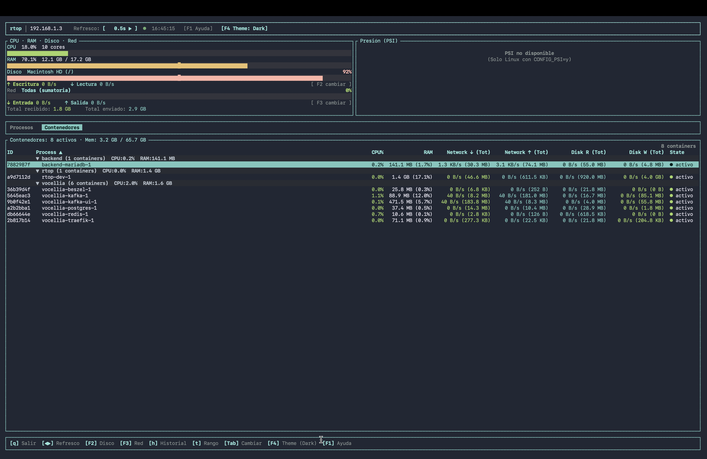

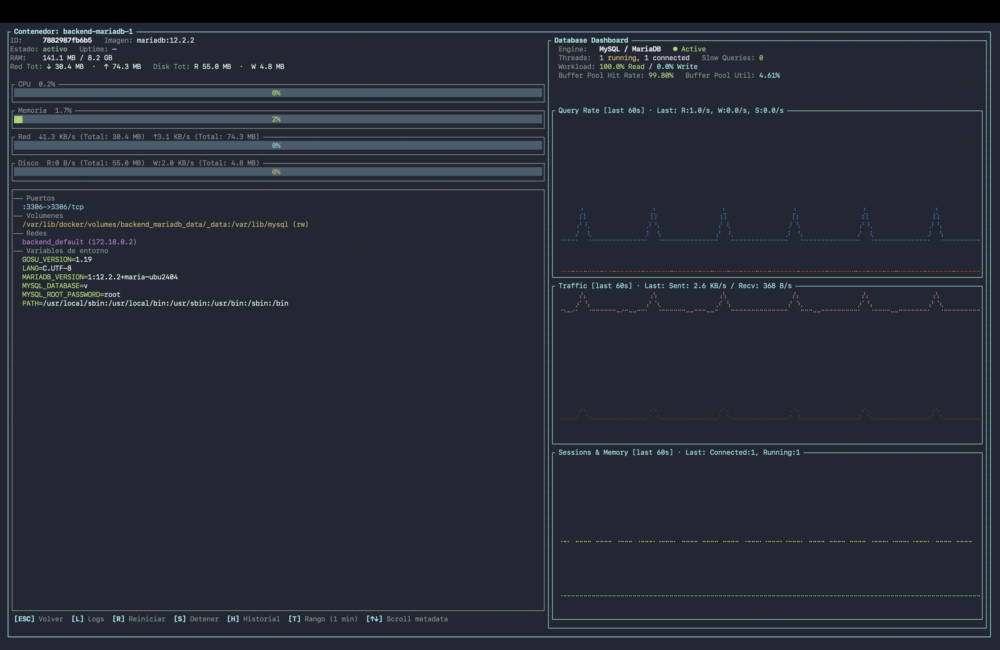

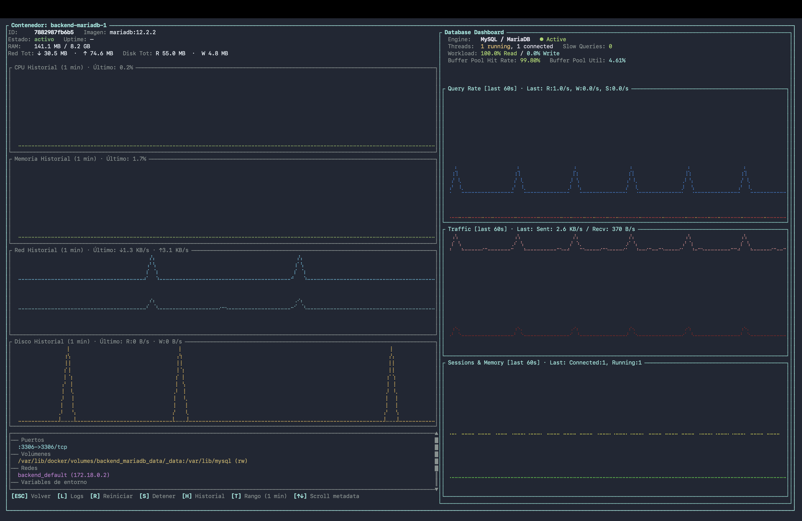

</details>

---

## ✨ Features

- **Real-time system monitoring** — CPU, RAM, Swap, Disk I/O, and Network throughput in a clean 2-column layout
- **Process monitoring** — sortable table with per-process CPU, memory, and disk read/write speeds; full process detail view
- **Docker/Podman integration** — native container monitoring with stats, logs, restart/stop controls
- **Application-aware database dashboards** — auto-detects PostgreSQL, MySQL, and MariaDB processes (local or in containers) and renders live metrics with historical Braille charts
- **Historical metrics charts** — Braille-rendered canvas charts for CPU, memory, disk, and network history; configurable time ranges (1 min → 5 min → 15 min → 1 hour)
- **Premium themes** — Default, Dracula, Gruvbox, and Tokyo Night; cycle with `F4` or the on-screen button
- **Dynamic localization** — automatic English/Spanish UI based on your system locale (`LANG`, `LC_ALL`, `LC_MESSAGES`)
- **Minimal footprint** — under 15 MB RAM at runtime

---

## 🏗️ Architecture

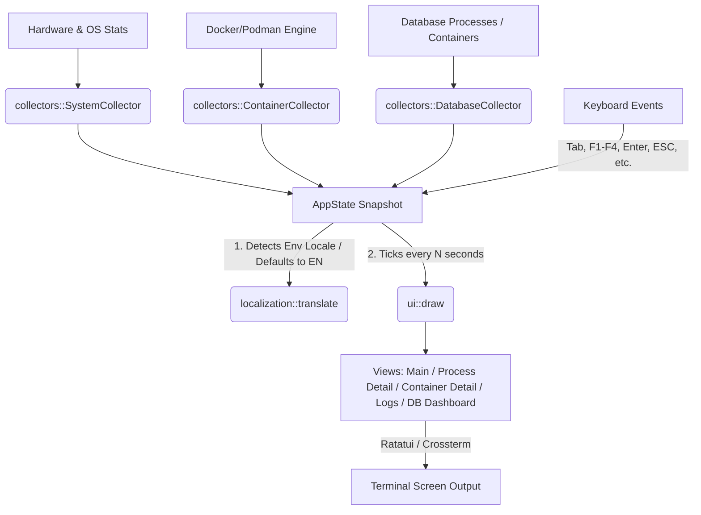

---

## ⚡ Installation

### 1. Quick Installation Script (Linux & macOS)
Automatically detects your OS and architecture, downloads the latest pre-compiled binary, and installs it to `/usr/local/bin/`:

```bash
curl -fsSL https://github.com/rebienkrdns/rtop/raw/master/install.sh | sh
```

### 2. From Crates.io
If you have Cargo installed:

```bash
cargo install rtop
```

### 3. Packages for Linux Distributions
Download the packages directly from the [GitHub Releases](https://github.com/rebienkrdns/rtop/releases):
*   **Debian/Ubuntu (`.deb`):** `sudo dpkg -i rtop_*.deb`
*   **RHEL/CentOS/Fedora (`.rpm`):** `sudo rpm -i rtop_*.rpm`

### 4. Compiling from Source
```bash
git clone https://github.com/rebienkrdns/rtop.git
cd rtop
cargo build --release
```
The optimized binary will be located in `target/release/rtop`.

---

## ⚙️ Configuration

`rtop` stores its configuration file at `~/.config/rtop/config.toml` (or the path specified by the `RTOP_CONFIG_PATH` environment variable). The file is generated automatically with default values on first launch.

### `config.toml` Example

```toml
# Refresh interval in seconds (supported values: 0.5, 1.0, 2.0, 5.0, 10.0, 30.0, 60.0)
refresh_interval_secs = 2.0

# Default disk device to monitor for I/O (e.g., "nvme0n1", "sda")
# If set to None, rtop tries to autodetect the primary disk
selected_disk = "nvme0n1"

# Default network interface to monitor (e.g., "eth0", "wlan0")
# If set to None, it aggregates traffic of all active interfaces
selected_nic = "eth0"

# Active tab at startup ("processes" or "containers")
default_tab = "processes"

# Column to sort processes by ("cpu", "memory", "pid", "name")
process_sort_column = "cpu"

# Show or hide Swap memory section
show_swap = true

# Active theme ("default", "dracula", "gruvbox", "tokyo_night")
theme = "default"

# Custom path to the Docker socket (e.g., "/var/run/docker.sock")
# docker_socket_path = "/var/run/docker.sock"
```

---

## ⌨️ Keyboard Shortcuts

| Key | Action |
| :---: | :--- |
| `q` / `Ctrl+C` | Quit the application |
| `Tab` | Toggle between tabs (Processes ↔ Containers) |
| `↑` / `↓` | Navigate lists |
| `Enter` | View details of the selected process or container |
| `ESC` | Back to previous screen / Close modal |
| `F1` | Show help modal |
| `F2` | Open disk device selector |
| `F3` | Open network interface selector |
| `F4` | Cycle through themes (Default → Dracula → Gruvbox → Tokyo Night) |
| `[` | Decrease refresh interval (faster updates) |
| `]` | Increase refresh interval (slower updates) |
| `c` | Sort processes by CPU usage |
| `m` | Sort processes by Memory usage |
| `r` | Sort processes by Disk Read speed |
| `w` | Sort processes by Disk Write speed |
| `/` | Filter processes/containers by name |
| `h` | Toggle between historical charts and bar gauges |
| `t` | Cycle history time ranges (1 min → 5 min → 15 min → 1 hour) |
| `L` | *(Containers)* View logs in detail view |
| `R` | *(Containers)* Restart container (requests confirmation) |
| `S` | *(Containers)* Stop container (requests confirmation) |

---

## 🗄️ Database Monitoring

`rtop` automatically detects running PostgreSQL, MySQL, and MariaDB instances — whether running as local processes or inside Docker/Podman containers. When you enter the detail view of a detected database process or container, `rtop` renders an application-specific dashboard with:

- Live connection counts, query throughput, cache hit rates, and engine-specific metrics
- Historical Braille charts for all key indicators
- Support for credential overrides via `config.toml` (useful when connecting to containers)

No manual configuration is needed for local instances with default socket/port settings.

---

## 🌐 Dynamic Localization

`rtop` defaults to **English**. On startup, it checks standard environment variables (`LANG`, `LC_ALL`, `LC_MESSAGES`) to determine the system locale. If your system is set to **Spanish** (e.g. starting with `es`), the interface and command-line help options will automatically switch to Spanish.

---

## 🛠️ Troubleshooting

### 1. Docker Socket Permission Error
If you get a connection error when switching to the `Containers` tab:
*   Ensure your user is added to the `docker` group:
    ```bash
    sudo usermod -aG docker $USER
    ```
    *(Log out and back in to apply group changes).*
*   If you are running Podman or a non-standard socket, specify the route using `docker_socket_path` in `config.toml`.

### 2. File System `/proc` Permissions
In highly restricted containerized environments, `rtop` might fail to read `/proc`.
*   Ensure your container is run with proper host access:
    ```bash
    docker run --privileged -v /proc:/host/proc:ro rtop
    ```

---

## 📄 License

This project is licensed under the **MIT** License. See the [LICENSE](LICENSE) file for more information.
